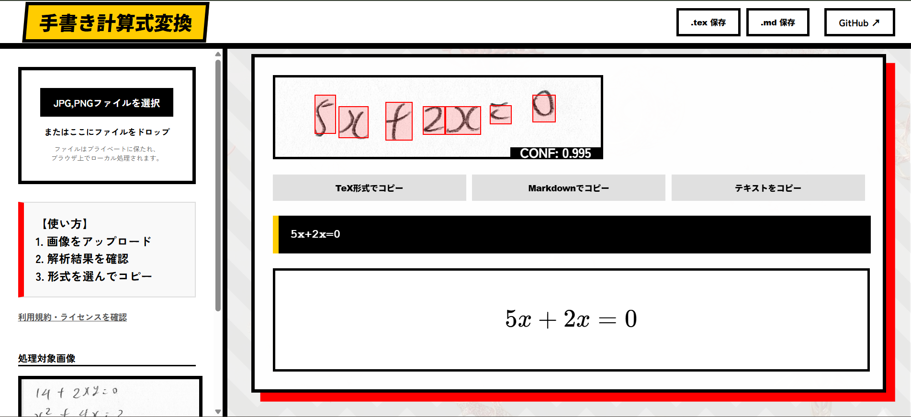

# Handwritten Formula to LaTeX/Markdown Converter

紙に書かれた手書きの計算式を画像（JPG, PNG）から読み取り、デジタルな数式データ（LaTeX/Markdown）へ瞬時に変換するWebアプリケーションです。
YOLOv8による構造解析と、独自CNNによる記号認識を組み合わせたハイブリッドシステムを搭載しています。

## 主な機能

- **数式領域の自動検出**: YOLOv8を用いて、画像内の複数の数式を自動で検出し、1行ずつ切り出します。
- **記号認識**: HASYv2とMNISTを統合したデータセットで学習したCNNにより、変数・演算子・数字を判別。
- **インテリジェントな構造解析**: 
    - 記号の位置関係（中心座標と高さ）から「べき乗（上付き文字）」を自動判定。
- **直感的なWeb UI**: 
    - ドラッグ＆ドロップで画像をアップロードするだけの簡単操作。
    - 認識結果をKaTeXで即座にプレビュー表示。
    - LaTeX形式（$ ... $）やMarkdown形式（$$...$$）でのワンクリックコピー。

## アプリ画面



## 🛠 動作環境

| 項目 | バージョン / 詳細 |
| :--- | :--- |
| **OS** | Windows 11 |
| **Python** | 3.13.9 |
| **Deep Learning** | PyTorch 2.6.0, Ultralytics 8.4.21 (YOLOv8) |
| **Computer Vision** | OpenCV 4.13.0.92 |
| **Backend** | Flask |

## 📂 ディレクトリ構成

```text
.
├── app.py                # Flaskアプリケーション（ルーティング・推論制御）
├── recognition_logic.py  # CNNモデル定義・数式組み立てロジック
├── shiki_models/         # 学習済みモデル格納用（.pt, .pth, .json）
├── templates/
│   ├── index.html        # メインWebインターフェース
│   └── terms.html        # 利用規約・ライセンス表示ページ
├── static/
│   └── uploads/          # 解析時の一時保存用ディレクトリ
└── README.md
